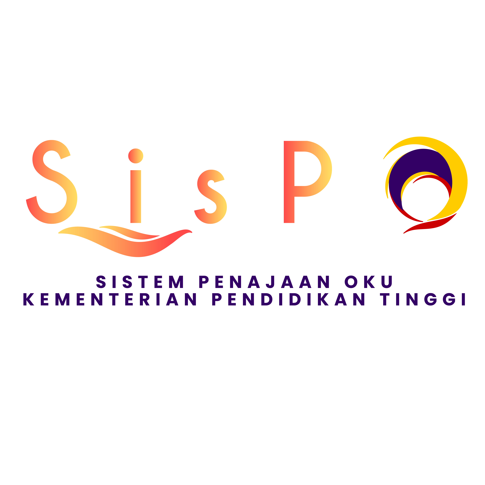

  

## 📌 Ringkasan Sistem SISPO

**SisPO (Sistem Penajaan Orang Kurang Upaya)** ialah sebuah sistem berasaskan web yang dibangunkan untuk mengurus proses permohonan, semakan, dan pengurusan data pemohon secara berpusat serta sistematik. Sistem ini bertujuan mempercepatkan aliran kerja pentadbiran di samping meningkatkan ketepatan dan kecekapan pengurusan maklumat.

SisPO menyediakan fungsi utama seperti pendaftaran pengguna, penghantaran permohonan, pengurusan rekod, pemantauan status permohonan, serta penyediaan laporan sokongan untuk kegunaan pihak pentadbir. Sistem ini direka bentuk secara responsif dan mesra pengguna, selaras dengan keperluan operasi semasa.
